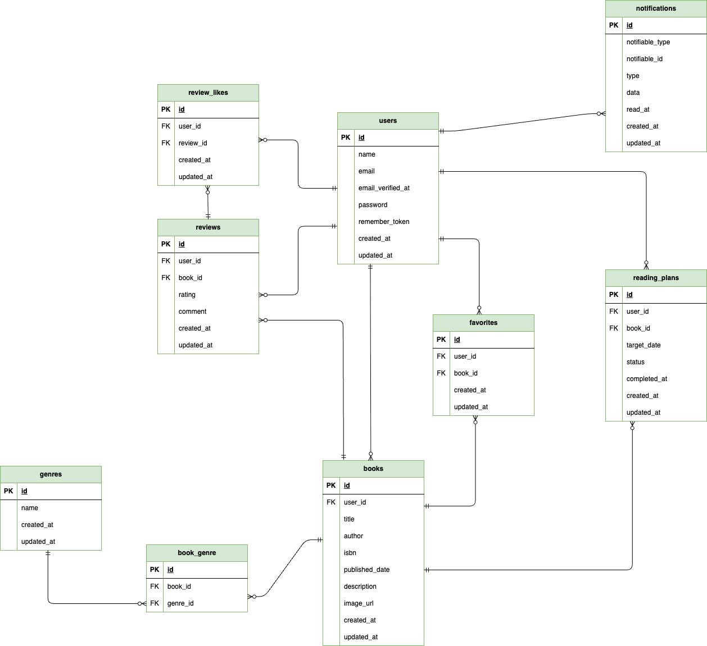

# BookShelf 書籍レビューアプリ

## 概要

「BookShelf」は、書籍の登録・閲覧やレビューの投稿、お気に入り登録などができる書籍レビューアプリケーションです。
書籍をジャンルごとに管理できるほか、レビューの平均評価に基づくランキング、キーワード・ジャンル・並び順を組み合わせた書籍検索、読書計画やリマインダー通知、読書状況を確認できるマイ読書レポート機能を備えています。
また、Google Books APIを利用したISBN-13による書籍情報の自動取得や、外部アプリケーション向けの公開APIを提供しています。

## ER図


## 環境構築手順

### Dockerビルド

1. リポジトリをクローン

```bash
git clone https://github.com/keiko788/bookshelf-app.git
```
2. プロジェクトディレクトリへ移動

```bash
cd bookshelf-app
```
3. Composerパッケージをインストール

```bash
docker run --rm \
    -u "$(id -u):$(id -g)" \
    -v "$(pwd):/var/www/html" \
    -w /var/www/html \
    -e COMPOSER_CACHE_DIR=/tmp/composer_cache \
    laravelsail/php82-composer:latest \
    composer install
```

4. `.env` ファイル作成

```bash
cp .env.example .env
```
`.env` ファイルを作成後、以下の設定を確認してください。

```env
DB_CONNECTION=mysql
DB_HOST=mysql
DB_PORT=3306
DB_DATABASE=laravel
DB_USERNAME=sail
DB_PASSWORD=password
```

5. Sailを起動

```bash
./vendor/bin/sail up -d --build
```


### Laravel環境構築

1. アプリケーションキー作成

```bash
./vendor/bin/sail artisan key:generate
```

2. マイグレーションと初期データ投入

```bash
./vendor/bin/sail artisan migrate --seed
```
※ テーブルを作成し、ダミーデータを投入します。

3. フロントエンド依存パッケージをインストール

```bash
./vendor/bin/sail npm install
```

### Google Books APIの設定

1. [Google Cloud Console](https://console.cloud.google.com/)にアクセスし、Googleアカウントでログインします。

2. 使用するプロジェクトを作成、または選択します。

3. 「APIとサービス」からBooks APIを有効化します。

4. 「認証情報」からAPIキーを作成します。

5. 取得したAPIキーを`.env`ファイルに設定します。

```env
GOOGLE_BOOKS_API_KEY=取得したAPIキー
```

設定後、Laravelの設定キャッシュが残っている場合は以下を実行してください。

```bash
./vendor/bin/sail artisan config:clear
```

### アプリケーションの起動

Vite開発サーバーを起動します。

```bash
./vendor/bin/sail npm run dev
```
※ アプリケーションを使用している間は、このコマンドを実行したターミナルを起動したままにしてください。


### 動作確認

Vite開発サーバー起動後、以下のURLにアクセスしてください。

http://localhost/books

書籍一覧画面が表示されれば、環境構築は完了です。

## テスト

Vite開発サーバーを起動した状態で、別のターミナルから以下のコマンドを実行してください。

```bash
./vendor/bin/sail artisan test
```

全てのテストがPASSとなれば正常です。

## 使用技術

- PHP 8.5
- Laravel 10.x
- MySQL 8.4
- Docker
- Laravel Sail
- phpMyAdmin
- Tailwind CSS 3.4
- Vite
- Laravel Fortify
- Laravel Sanctum
- Google Books API


## APIエンドポイント一覧

| メソッド | エンドポイント | 内容 | 認証 |
|---|---|---|---|
| GET | `/api/v1/books` | 書籍一覧を取得 | 不要 |
| GET | `/api/v1/books/{book}` | 書籍詳細を取得 | 不要 |
| POST | `/api/v1/books` | 書籍を登録 | 必要 |
| PUT/PATCH | `/api/v1/books/{book}` | 書籍情報を更新 | 必要 |
| DELETE | `/api/v1/books/{book}` | 書籍を削除 | 必要 |


### API認証

書籍一覧・書籍詳細の取得APIは、認証なしで利用できます。

書籍の登録・更新・削除APIには、Laravel Sanctumによる認証を設定しています。

本アプリケーションではAPIトークンの発行機能は実装していません。
認証が必要なAPIについては、Feature Test内でLaravel Sanctumの認証状態を作成して動作を確認しています。

API関連のテストは、以下のコマンドで実行できます。

```bash
./vendor/bin/sail artisan test
```

### 開発環境URL

- 書籍一覧画面
    - http://localhost/books
- ユーザー登録
    - http://localhost/register
- phpMyAdmin
    - http://localhost:8080


## 作成者

長岡　啓子


